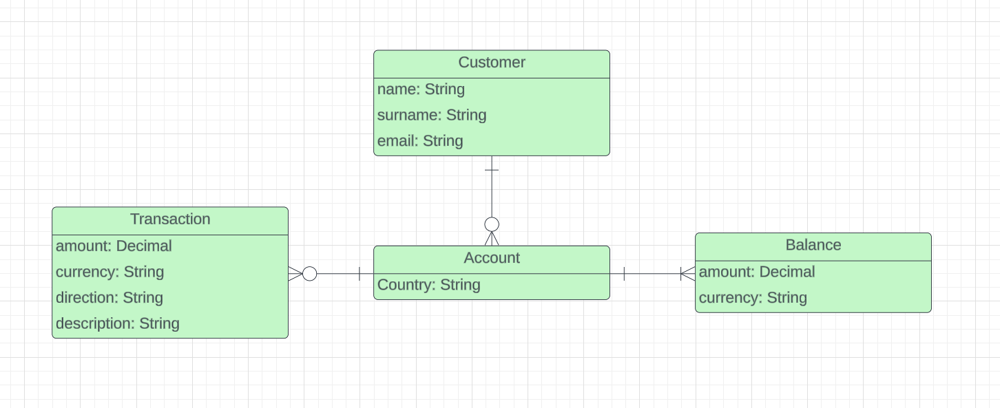

# Getting Started
## Setup with Docker
This project is configured to use Docker.
#### Docker Configuration
The Docker environment is defined in a `docker-compose.yml`.
- **PostgreSQL Database**: Runs PostgreSQL server on port "5432:5432".
- **RabbitMQ**: Provides a RabbitMQ server on ports "5672:5672" and "15672:15672".
- **Springboot application** runs on port "8080:8080".
#### Building and running the application
To build and start the services defined in the Docker configuration,
run the following command in the root directory of the project: `docker-compose up --build`.
## Database
This project uses Liquibase for database schema management.
Below is an overview of how the changelogs are structured in this project.
The Liquibase changelogs are located in the `resources/db/changelog` directory within the project.
- **`changelog-master.xml`**: This is the root changelog file.
- **`changelog-tables.xml`**: This file contains the database schema changes.
- **`changelog-insert.xml`**: This file is used for inserting initial data into the database.
### Database structure
The database for this project is designed of
four key tables: `customers`, `accounts`, `balances`, and `transactions`.

#### Enum Usage in Database Management
Countries, currencies, and transaction directions are handled using enums.
Before any data related to these fields is added to the database, it undergoes
checks against these enums to ensure that only valid values are used.
This method were chosen because using enums reduces the complexity of validation logic in the application.
### MyBatis
This project utilizes MyBatis to facilitate the mapping between application and the database.
#### MyBatis Configuration
The mappers are located under the `resources/mapper` directory.
Results are mapped in corresponding files in package `com/example/bankingSolution/dao`.

## Functionality
#### Account creation
- **Endpoint** : `http://localhost:8080/api/account/add`
- **Example body**: {
  "customerId": 3,
  "country": "IT",
  "currencies": ["EUR"]
  }
- **Result**: {
  "id": 1,
  "customerId": 1,
  "balances": [
  {
  "amount": 10.00,
  "currency": "EUR"
  },
  {
  "amount": 2500.00,
  "currency": "USD"
  }
  ]
  }
- **Possible errors**:
- - "error": "No customer with ID: {id}"
- - "error": "Invalid country: {country}"
- - "error": "Invalid currency: {currency}"
- - "error": "Account should have at least 1 currency."
- - "error": "Currencies/customerId/country cannot be null."

#### Get account by id
- **Endpoint** : `http://localhost:8080/api/account/get/1`
- **Result**: {
  "id": 3,
  "customerId": 3,
  "balances": [
  {
  "amount": 0.00,
  "currency": "EUR"
  }
  ]
  }
- **Possible errors**:
- - "error": "No account with ID: id"
#### Transaction creation
- **Endpoint** : `http://localhost:8080/api/transaction/add`
- **Example body**: {
  "accountId": 2,
  "amount": 15,
  "currency": "EUR",
  "direction": "IN",
  "description": "Shopping"
  }
- **Result**: "id": 6,
  "accountId": 2,
  "amount": 15,
  "currency": "EUR",
  "direction": "IN",
  "description": "Shopping",
  "balanceAfterTransaction": {
  "amount": 115.00,
  "currency": "EUR"
  }
- **Possible errors**:
- - "error": "No customer with ID: {id}"
- - "error": "Invalid country: {country}"
- - "error": "Invalid currency: {currency}"
- - "error": "Invalid direction: {direction}"
- - "error": "Insufficient funds"
- - "error": "Account with ID {id} does not have balance with currency {currency}"
- - "error": "accountId/amount/currency/direction/description cannot be null."
#### Get transactions by account id
- **Endpoint** : `http://localhost:8080/api/transaction/get/2`
- **Result**: [
  {
  "id": 3,
  "accountId": 2,
  "amount": 80.00,
  "currency": "SEK",
  "direction": "OUT",
  "description": "Gasoline"
  },
  {
  "id": 4,
  "accountId": 2,
  "amount": 150.00,
  "currency": "SEK",
  "direction": "IN",
  "description": "Present"
  },
  {
  "id": 5,
  "accountId": 2,
  "amount": 100.00,
  "currency": "EUR",
  "direction": "IN",
  "description": "Salary"
  }
  ]

- **Possible errors**:
- - "error": "No account with ID: {id}"

## Tests
Integration tests are located in package `src/test/java/integrationTests`.